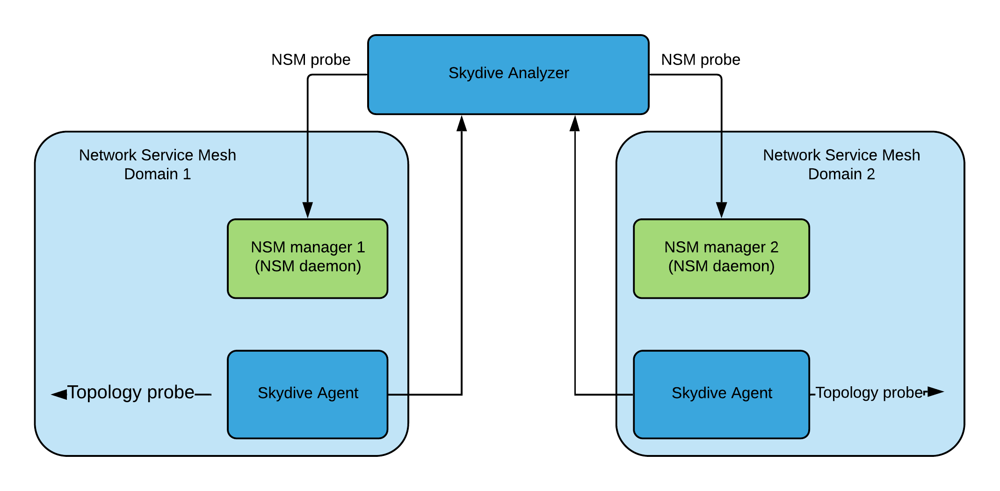
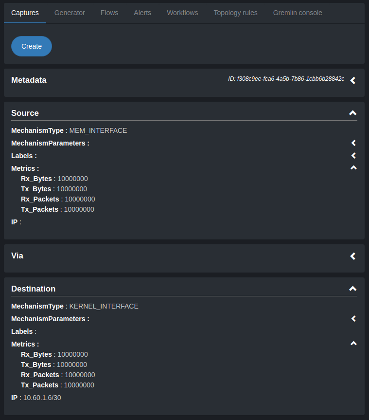
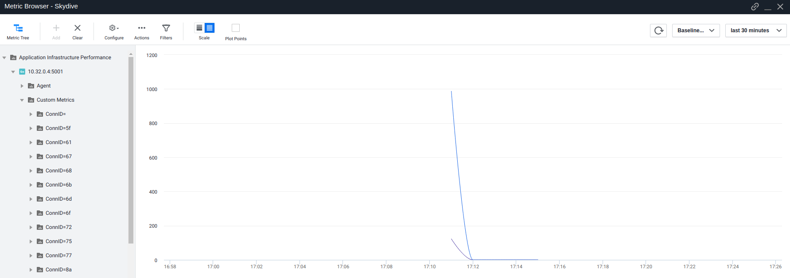
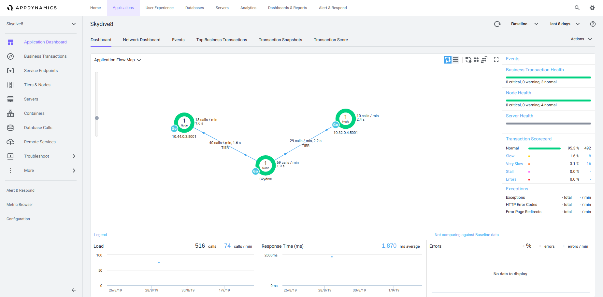

# Skydive

Skydive is an open source real-time network topology and protocols analyzer.
It aims to provide a comprehensive way of understanding what is happening in
the network infrastructure.

Skydive agents collect topology informations and flows and forward them to a
central analyzer for further analysis. All the informations can be stored in an
real-time databases such as OrientDB.

Key features:
* Captures network topology and flows
* Supports VMs and Containers infrastructure (i.e. Docker, K8s, OpenStack...)
* Distributed

In Network Service Mesh, Skydive is used as a telemetry tool to collect metrics (bytes, packets,...) and build topology of Network Service Mesh.

## Quick-start:

There are various ways to start with Skydive, it can be easily in [here](http://skydive.network/tutorials/first-steps-1.html).
In this docs, I will introduce how to start Skydive in Network Service Mesh and how to apply new implementations of Skydive to the Network Service Mesh.
### Skydive in Network Service Mesh:
#### Introduction:
In Network Service Mesh, Skydive is used as a telemetry tool to collect metrics (bytes, packets,...) and build topology of Network Service Mesh.
Skydive sends 2 probes to Network Service Mesh, docker probe to collect topology information and nsm probe to collect NSM data.
Moreover, Skydive is running as K8s pods in network service mesh domain, one agent for each nodes to collect topology information
and one analyser to connect to each NSM manager to collect NSM metrics and gather topology information from agents to build the global topology.
     <figcaption align="middle"></figcaption>
     <figcaption align="middle"><strong>Figure 1. Skydive in Network Service Mesh</strong></figcaption>
#### How to deploy Skydive in Network Service Mesh:
In order to deploy Skydive in K8s in general and NSM in particular, a YAML file is needed to deployed it.
To be more detailed, The YAML file is in [here](https://github.com/quangtamle/NSM_lab/blob/master/Labs/networkservicemesh/networkservicemesh/k8s/conf/skydive.yaml).
In this file, you can choose the probes you want to run in Agent and Analyser in [here](https://github.com/quangtamle/NSM_lab/blob/master/Labs/networkservicemesh/networkservicemesh/k8s/conf/skydive.yaml#L47)
and the Skydive (docker) image in [here](https://github.com/quangtamle/NSM_lab/blob/master/Labs/networkservicemesh/networkservicemesh/k8s/conf/skydive.yaml#L85).
Skydive image is very important part to deploy Skydive in NSM and to develop more implementations in Skydive.
#### Implementations in Skydive:
I recognized that nsm probe does not report NSM metrics in the metadata. 
Thus, My implementations is mainly about adding NSM metrics into metadata and showing this on the graph.
There are 2 ways to display NSM metrics into metadata:
 * Adding those metrics directly into metadata. The picture below will show an example.
          <figcaption align="middle"></figcaption>
          <figcaption align="middle"><strong>Figure 2. NSM metrics displayed in Skydive</strong></figcaption>
 * Using another third-party application like [AppDynamics](https://www.appdynamics.com/)...AppDynamics has 2 main components: AppD controller and
AppD agents. The agents will send all the metrics collected from the system to the controller. In this implementation, AppD agent run inside Skydive analyzer, collect and send all the NSM sent by NSM to the AppD controller.
Moreover, AppDynamics can also show the topology of the NSM domain. The pictures below will show the results of AppDynamics.
          <figcaption align="middle"></figcaption>
          <figcaption align="middle"><strong>Figure 3. NSM metrics displayed in AppDynamics</strong></figcaption>
and 
          <figcaption align="middle"></figcaption>
          <figcaption align="middle"><strong>Figure 4. NSM topology displayed in AppDynamics</strong></figcaption>

All of my implementations can be found [here](https://github.com/quangtamle/NSM_lab/tree/master/Labs/skydive/topology/probes/nsm)

In case you want to modify the colors, the icons or the movement of the nodes, you can modify in this [folder](https://github.com/quangtamle/NSM_lab/tree/master/Labs/skydive/statics)

* For the color of the nodes: you can change the colors of the nodes in this [file](https://github.com/quangtamle/NSM_lab/blob/master/Labs/skydive/statics/css/graph-layout.css)
* For the icons of the nodes: First, you need to add icons you want into this [folder](https://github.com/quangtamle/NSM_lab/tree/master/Labs/skydive/statics/img). Then you can declare new icons in this [file](https://github.com/quangtamle/NSM_lab/blob/master/Labs/skydive/statics/js/components/layout.js).
* For the movement of the nodes: you can change the value of this [variable](https://github.com/quangtamle/NSM_lab/blob/master/Labs/skydive/statics/js/components/graph-layout.js#L260). You can read more from [this docmentation](https://github.com/d3/d3-force)

After modifying all the those things, you need to "make .bindata" in [skydive](https://github.com/quangtamle/NSM_lab/tree/master/Labs/skydive) folder to apply those changes in static folder.

After finishing the implementations, I do some follow steps:
* "go generate" in [nsm](https://github.com/quangtamle/NSM_lab/tree/master/Labs/skydive/topology/probes/nsm) folder if you have any changes in metadata.go
* "go instal" in [skydive](https://github.com/quangtamle/NSM_lab/tree/master/Labs/skydive) folder to generate binary file.
* "make docker-image" in skydive folder to generate docker image. This command will generate an image named "skydive/skydive:devel"
* "docker tag skydive/skydive:devel YOUR_DOCKER_ACC/skydive:VERSION" it will tag the new image with the name (for example: tamlq/skydive:stable)
* "docker push YOUR_DOCKER_ACC/skydive:VERSION" push that image to your docker hub and use it in [YAML file](https://github.com/quangtamle/NSM_lab/blob/master/Labs/networkservicemesh/networkservicemesh/k8s/conf/skydive.yaml) to deploy skydive in NSM

## Further Documentation:

Skydive documentation can be fully found here:

* http://skydive.network/documentation
