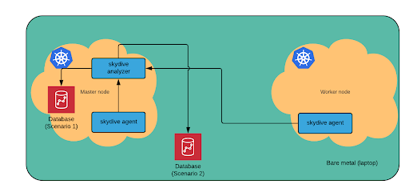

A detailed describe about this lab:
==================================
# Introduction:
* Network Service Mesh (NSM) is a new solution for layer 2/3 connection between Network Service Client (NSC) and Network Service Endpoint (NSE).
For example: I want a specific (secure) connection between my pods and a specific resource (i.e DB,...) which is outside of my cluster then NSM is a good solution for those kind of problem. 
* In the scope of this lab, NSC and NSE are Pods in Kubernetes. NSC is a Pod running applications and want to have a network service. NSE is a Pod that network services (FW, VPN gateway, ...)
* Skydive is an open-source tool for real-time monitoring and analyze traffic in the network. It is used in this lab to collect telemetry data from NSM. There are 2 components in Skydive: Analyzer and Agent. Agents send probes (vpp, docker, nsm,…) to collect real time data and send it back to the analyzers which will build the whole network topology and analyze the network.

# The LAB setup:
The goal of this LAB is to integrate an graph and time-series DB (Neo4j, OrientDB,...) into Network Service Mesh and connect that to Skydive to store all the traffic metrics from the Network Service Mesh.
In this lab, I reuse [NSM lab](https://github.com/networkservicemesh/networkservicemesh) and implement a new graph and time-series DB into NSM because at the moment, there is no such DB in the NSM and Skydive only stores the metrics on RAM which is not a good solution for the long term storage.

* **Describing the LAB**:
  * I have 2 VMs which are 2 K8s nodes for the NSM. In those nodes, there are many pods as NSC, NSE and k8s components and Skydive from the beginning. Skydive is running inside NSM to collect metrics and store everything in RAM.
        <figcaption align="middle"></figcaption>
        <figcaption align="middle"><strong>Figure 1. The starting lab</strong></figcaption>
  * I try 2 scenarios for deploying the DB.
    * The first scenario is to deploy the DB directly into one of the clusters by creating a container for the DB.
    * The second scenario is to deploy the DB directly on bare metal (my laptop) as a software and store the traffic metric from NSM.
        <figcaption align="middle"></figcaption>
        <figcaption align="middle"><strong>Figure 2. The expected lab</strong></figcaption>
* **Deploying the DB and connecting it to the Skydive**:
   *  **Deploying the DB**:
      *  Scenario 1: Deloying the DB as a service on k8s cluster
         *  Download the orientdb image and run it in k8s master (or k8s worker):
            *  docker image pull orientdb
            *  docker run –it --name=orientdb –p 2480 orientdb
      *  Scenario 2: Deploying the DB as a service on bare metal (laptop)
         *  Download the package and follow the installation instruction from the [official website](http://www.orientdb.com/docs/last/Tutorial-Installation.html) then you have the OrientDB run as a service in laptop.
   *  **Connecting the DB to the Skydive**:
      *  Step 1: On the OrientDB side:
         *  Creating a specific DB for Skydive. There are 2 ways to do that:
            *  Via WebUI: <Your_IP_ADD>:2480
            *  Via console of OrientDB:
               *  Start the console: /opt/orientdb/bin/console.sh
               *  Create the DB: create database remote:/yourDatabaseName yourUsername yourPassword local
      *  Step 2: On the Skydive side:
         *  Configuring some information in Skydive config YAML file to connect to the DB. The following configurations are shown as below:
            <figcaption align="middle"></figcaption>
            <figcaption align="middle"><strong>Figure 3. The Skydive Config YAML file</strong></figcaption>
         *  And run the Skydive service by command “kubectl apply –f <Skydive-config-file-name>.yaml”.
         *  Depending on your purposes, you can choose which probes you want to use in Skydive. For example: I use VPP probe to collect information in the dataplane (which is VPP) of NSM. Moreover, docker probes collect information of containers within the clusters or nsm probes implemented by NSM team collect information related to NSM stuff (for example: crossconnect, packet sent, drop, received,...).
         *  By the way, there is no need to configure anything on VPP or dataplane in general, everything will be handled by Skydive and VPP probes.
*  **Verifying the connection between Skydive and OrientDB**:
   *  Checking Skydive service run well on k8s cluster after connected to the OrientDB by command “Kubectl get all” and “kubectl logs | grep skydive”. If there is no error log related to skydive and skydive pods are ready (as the picture below) which means everything is going well untill now.
            <figcaption align="middle"></figcaption>
            <figcaption align="middle"><strong>Figure 4. Verifying the Skydive service</strong></figcaption>
   *  Next, logging into OrientDB webUI to check whether Skydive stores the data or not by querying command “select from v” (it will query all the nodes information from DB). If it returns values, Yay !!!! Congratulation, it works. Otherwise, checking again the name of DB is matched with the DB name in Skydive config YAML file or not.
   *  Besides, it is optional to login to the Skydive webUI to check the traffic toward OrientDB container.
# Conclusion:
Time-series and graph database is a very useful database for telecom and network operators in the new era of the network (NFV, SDN, clouds,...). This lab has introduced how to combine the database and a monitoring tool such as Skydive and applied into network. Moreover, it is suggested 2-ways to place the database depending on the network and how operators want to manage it.

