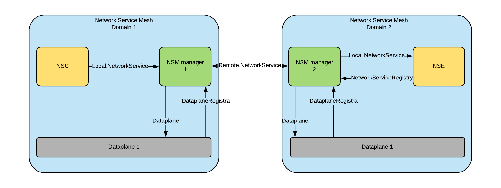

APIs in Network Service Mesh
============================
The origin of the APIs is from [Network Service Mesh](https://github.com/networkservicemesh/networkservicemesh/tree/master/controlplane/pkg/apis). This document is just a detail explanation and used for local non-commercial purposes. All the APIs in this document are defined in Protocol Buffer for communication over gRPC. If you are not familiar with Protocol Buffer and gRPC, you can read more about it in [Protobuf](https://developers.google.com/protocol-buffers/docs/proto) and [gRPC](https://grpc.io/docs/quickstart/go/) (it is useful to understand the below APIs).

# APIs to interact between entities (Network Service Endpoint (NSE), Network Service Client (NSC), dataplane, NSM manager (NSMgr)) in NSM

<figcaption align="middle"><strong>Figure 1. How NSM entities interact to each other</strong></figcaption>

* **NetworkServiceRegistry**:
  * The NSE will register to the NSM manager to expose the services (Firewall, VPN gateway,...) it provides and notify that it is ready for providing the services. This API is only for NSE because NSE provides Network service which need to expose to the world through this API.
  * The code below shows how NSEs register themselves to the NSMgr. The full code can be found [here](https://github.com/quangtamle/NSM_lab/blob/master/Labs/networkservicemesh/networkservicemesh/controlplane/pkg/apis/registry/registry.proto) 
  ```proto
    message NSERegistration {
            NetworkService network_service = 1;
            NetworkServiceManager network_service_manager = 2;
            NetworkServiceEndpoint networkservice_endpoint = 3;
        }

    service NetworkServiceRegistry {
            rpc RegisterNSE (NSERegistration) returns (NSERegistration);
            rpc RemoveNSE (RemoveNSERequest) returns (google.protobuf.Empty);
        }
  ```
* **Local.NetworkService**:
  * The client will request a network service (Figure 3) to the NSM manager, it will create connection object (Figure 4) and specify the mechanism (kernel int, memIF, vHost,...). Mechanism negotiates between NSC and the next hop in your system (Dataplane in this case).
  * What NSM does is to allow you to specify what kind of **local connection** (the connection between NSC/NSE and the dataplane) you want. For example, for normal app pods need a secure connectivity, you just want a kernel interface or you have cloud-native app then you need some high performance interfaces like memIF…
  * The full code can be found [here](https://github.com/quangtamle/NSM_lab/tree/master/Labs/networkservicemesh/networkservicemesh/controlplane/pkg/apis/local) and [ConnectionContext](https://github.com/quangtamle/NSM_lab/blob/master/Labs/networkservicemesh/networkservicemesh/controlplane/pkg/apis/connectioncontext/connectioncontext.proto)
  ```proto
    message Connection {
        string id = 1;
        string network_service = 2;
        Mechanism mechanism = 3;
        connectioncontext.ConnectionContext context = 4;
        /* Connection context negotiates between NSC and NSE. For example, source and dest IPs, routes between NSCs and NSEs */
        map<string, string> labels = 5;
        State state = 6;
    }
    message Mechanism {
        MechanismType type = 1;
        map<string, string> parameters = 2;
    }
    enum MechanismType {
        DEFAULT_INTERFACE = 0;
        KERNEL_INTERFACE = 1;
        VHOST_INTERFACE = 2;
        MEM_INTERFACE = 3;
        SRIOV_INTERFACE = 4;
        HW_INTERFACE = 5;
    }
    message NetworkServiceRequest {
        local.connection.Connection connection = 1;
        repeated local.connection.Mechanism mechanism_preferences = 2;
    }

    service NetworkService {
        rpc Request(NetworkServiceRequest) returns (local.connection.Connection);
        rpc Close(local.connection.Connection) returns (google.protobuf.Empty);
    }
  ```
* **Remote.NetworkService**:
  * This remote network service is for the case where NSC and NSE are on the different NSM domains. Thus, the Remote.NetworkService is the negotiation between that two NSM managers. They exchange information to each other (for example: what kind of mechanisms it can provide...). Moreover, a **remote connection** is the connection between 2 dataplane belongs to 2 different NSM domains.
  * The full code can be found [here](https://github.com/quangtamle/NSM_lab/tree/master/Labs/networkservicemesh/networkservicemesh/controlplane/pkg/apis/remote)
  ```proto
    message Connection {
        string id = 1;
        string network_service = 2;
        Mechanism mechanism = 3;
        connectioncontext.ConnectionContext context = 4;
        map<string,string> labels = 5;
        string source_network_service_manager_name = 6;
        string destination_network_service_manager_name = 7;
        string network_service_endpoint_name = 8;
        State state = 9;
    }
    message Mechanism {
        MechanismType type = 1;
        map<string,string> parameters = 2;
    }

    enum MechanismType {
        NONE = 0;
        VXLAN = 1;
        VXLAN_GPE = 2;
        GRE = 3;
        SRV6 = 4;
        MPLSoEthernet = 5;
        MPLSoGRE = 6;
        MPLSoUDP = 7;
    }

    message NetworkServiceRequest {
        remote.connection.Connection connection = 1;
        repeated remote.connection.Mechanism mechanism_preferences = 2;
    }

    service NetworkService {
        rpc Request(NetworkServiceRequest) returns (remote.connection.Connection);
        rpc Close(remote.connection.Connection) returns (google.protobuf.Empty);
    }
  ```
* **Dataplane (1) and DataplaneRegistra (2)**:
  * Instead of directly programming on dataplane (VPP,...), the dataplane exposes APIs (DataplaneRegistra) to NSM manager (2) and NSM manager can request the crossconnect between NSCs and NSEs (1). The **crossconnect** is the connection between NSC and NSE. If NSC and NSE are in the same NSM domain, the **crossconnect** is the connection between **local connects** via the dataplane. Otherwise, the **crossconnect** is a connection including **local connects** and **remote connects**.
  * The full code can be found [here](https://github.com/quangtamle/NSM_lab/tree/master/Labs/networkservicemesh/networkservicemesh/dataplane/pkg/apis)
  ```proto
    /* Message sent by dataplane module informing NSM of any changes in its
     * operations parameters or constraints
     */
    message MechanismUpdate {
        repeated remote.connection.Mechanism remote_mechanisms = 1;
        repeated local.connection.Mechanism local_mechanisms = 2;
    }

    /* Dataplane inlcudes other operations which NSM will request dataplane module
     * to execute to establish connectivity requested by NSM clients.
     */
    service Dataplane {
        rpc Request (crossconnect.CrossConnect) returns (crossconnect.CrossConnect);
        rpc Close (crossconnect.CrossConnect) returns (google.protobuf.Empty);
        rpc MonitorMechanisms(google.protobuf.Empty) returns (stream MechanismUpdate);
    }
    message DataplaneRegistrationRequest {
    string dataplane_name = 1;
    string dataplane_socket = 2;
    }

    message DataplaneRegistrationReply {
    bool registered = 1;
    }

    service DataplaneRegistration {
        rpc RequestDataplaneRegistration (DataplaneRegistrationRequest) returns (DataplaneRegistrationReply);
        /*
         * RequestLiveness is a stream initiated by NSM to inform the dataplane that NSM is still alive and
         * no re-registration is required. Detection a failure on this "channel" will mean
         * that NSM is gone and the dataplane needs to start re-registration logic.
         */
        rpc RequestLiveness (stream google.protobuf.Empty) returns (stream google.protobuf.Empty);
    }
    message CrossConnect { /* Definitions of a CrossConnect */
        string id = 1;
        string payload = 2;

        oneof source {
            local.connection.Connection local_source = 4;
            remote.connection.Connection remote_source = 5;
        }
        oneof destination {
            local.connection.Connection local_destination = 6;
            remote.connection.Connection remote_destination = 7;
        }
    }
  ```
# APIs to monitor NSM:

 
<figcaption align="middle"><strong>Figure 9. Monitoring APIs in NSM</strong></figcaption>

* The main idea of monitoring in NSM is
  * From the start: NSE/NSC send the current state of the connections to their NSM managers.
  * After that, if there is anything happening within the connections, NSE/NSC will update events to their NSM managers or in case the crossconnect is on 2 different NSM domain, there will be an update between NSM managers.
* **Local.MonitorConnection**:
  * Local.MonitorConnection is the monitor where NSC reports and NSE asks for the update of the connections to/from NSM manager.
  ```proto
    enum ConnectionEventType {
        INITIAL_STATE_TRANSFER = 0;
        UPDATE = 1;
        DELETE = 2;
    }

    message ConnectionEvent {
        ConnectionEventType type = 1;
        map<string, Connection> connections = 2;
    }

    service MonitorConnection {
        rpc MonitorConnections (google.protobuf.Empty) returns (stream ConnectionEvent);
    }
  ```
* **Remote.MonitorConnection**:
  * The Remote.MonitorConnection is the communication between 2 NSM managers to exchange the status of crossconnects which are on that 2 NSM domains. The Remote.MonitorConnection looks like the same as the Local.MonitorConnection except MonitorScopeSelector message (it uses that to specify which NSM manager it connects). This Monitor is very useful because those NSM managers really want to know the status of the connections to do some other things like auto-healing,…
  ```proto
    enum ConnectionEventType {
        INITIAL_STATE_TRANSFER = 0;
        UPDATE = 1;
        DELETE = 2;
    }

    message ConnectionEvent {
        ConnectionEventType type = 1;
        map<string,Connection> connections = 2;
    }

    message MonitorScopeSelector {
        string network_service_manager_name = 1;
    }

    service MonitorConnection {
        rpc MonitorConnections(MonitorScopeSelector) returns (stream ConnectionEvent);
    }
  ```
* **MonitorCrossConnect**:
  * This API exposed by both dataplane and NSM manager. Dataplane exposes this to interact with NSM manager. Meanwhile, NSM manager exposes it in the northbound of NSM so that the other monitor tools like Skydive can interact with NSM.
  * The full code can be found [here](https://github.com/quangtamle/NSM_lab/blob/master/Labs/networkservicemesh/networkservicemesh/controlplane/pkg/apis/crossconnect/crossconnect.proto)
  ```proto
    enum CrossConnectEventType {
        INITIAL_STATE_TRANSFER = 0;
        UPDATE = 1;
        DELETE = 2;
    }
    message Metrics {
        map<string, string> metrics = 1;
    }
    message CrossConnectEvent {
        CrossConnectEventType type = 1;
        map<string, CrossConnect> cross_connects = 2;
        map<string, Metrics> metrics = 3;
    }
    service MonitorCrossConnect {
        rpc MonitorCrossConnects (google.protobuf.Empty) returns (stream crossconnect.CrossConnectEvent);
    }
  ```
