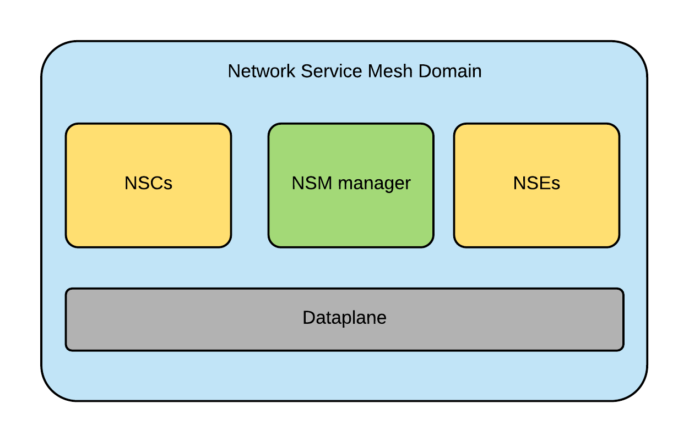

# Network Service Mesh (NSM)
* The Network Service Mesh project is a sandbox project. Thus, There are many updates about it by the time this document is written.

# What is Network Service Mesh ???

* Network Service processes requests related to layer 2 or layer 3 between its peers, for example: Ethernet frames, IP packets, MPLS frames, etc. Network Service Mesh is one type of Service Mesh which provides network service to its peers.

# Why do we need NSM ???

* In the current Kubernetes networking and, more generally in container networking technology, it is mainly concentrated on homogenous (i.e. using the same platform), low latency, high throughput, Ethernet/IP connections. Those features, however, still do not meet all the needs of Telcos, Internet Service Providers (ISPs), large enterprises, such as securing L2/L3 connections, supporting heterogeneous configuration , etc.
  
* Realizing the needs are still not fulfilled, Network Service Mesh is an interesting solution which allow for dynamic configuration of on-demand deployments. As a matter of fact, Network Service Mesh does not challenge but just want to enhance (extend) K8s networking which is done a very good job. Network Service Mesh improves networking in Kubernetes by adding the following features:
  * Network configuration in large service meshes (networks) with different operation systems, protocols and even different platform (Kubernetes, Docker Swarm, etc.) which is called Heterogeneous network configurations.
  * On-Demand and dynamic connections (MemIF, Vhost, Vxlan, GRE, SRv6, Traffic Engineeing,...).
  * Policy-driven Service Function Chaining (SFC).
* One benefit of Network Service Mesh brings to the Kubernetes is that it minimizes the change of the current-running Kubernetes system.

# Network Service Mesh Architecture:

* [Network Service Mesh](https://networkservicemesh.io/) is inspired by [Istio](https://istio.io/), but implemented with a different architecture. Meanwhile, Istio is a centralized architecture, NSM implements a decentralized model of service mesh which is easy for scalability, higher performance and higher availability when compared to a centralized one. Thus, there is no central entity as Mixer which holds the full state of the mesh.
* The components of the Network Service Mesh are:
  * Network Service Manager (NSMgr) is local (per node) management agent and plays role as sidecar proxy in Istio. The connection decisions are done by each NSMgr independently from the rest of the mesh.
  * Network Service Client (NSC) and Network Service Endpoint (NSE) are Pods of Kubernetes, VMs, physical devices,....**NSC** is basically any entity (Pods, VMs, physical devices,...) which needs a Network Service. For example, if there is an application Pod need an secure intranet connectivity, that would be an NSC. An **NSE** is simply an entity (Pods, VMs, physical devices,...) which provides a Network Service and processes the L2/L3 (Ethernet/IP) payloads from the NSC. In the scope of this project, I tend to talk about NSE/NSC as Pods because it is easy to understand and mostly relevant in the Kubernetes environment.
  * Dataplane (NSMD) is based on [VPP](https://wiki.fd.io/view/VPP) and [VPP agent](https://github.com/ligato/vpp-agent). NSMD is very flexible. As long as a dataplane can expose the [NSM dataplane API](Docs/NSM-APIs.md), it can be NSM dataplane.
  * NSM registry is a central repository for registering the Pods (NSC, NSE, NSMD, etc.), which runs in Kubernetes master. Each Kubernetes cluster has one NSM registry. In K8s enviroment, NSM registry is K8s API server because it provides good API machinery so NSM registry takes advantage on that.

* The below are the typical NSM domain and the general NSM Architecture:
   <figcaption align="middle"></figcaption>
     <figcaption align="middle"><strong>Figure 1. The typical NSM domain</strong></figcaption>
        
   <figcaption align="middle"></figcaption>
     <figcaption align="middle"><strong>Figure 2. The general NSM architecture</strong></figcaption>